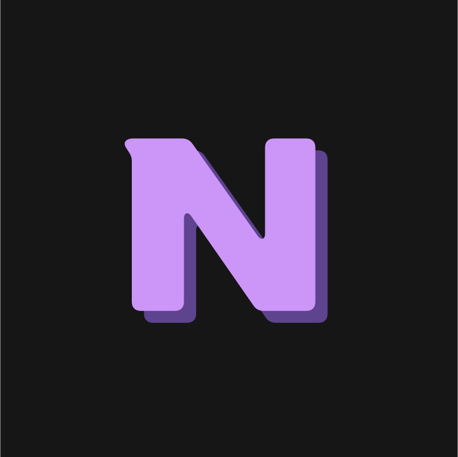

<picture>
  <source media="(prefers-color-scheme: dark)" srcset="Neon-plus-logo.svg">
  
</picture>

# NeonPlus 1.0

NeonPlus 是一个基于C/C++编程语言的编程语言，一种无限VM编译器/VM虚拟机可以调用C-API、字节码转译C源码

Main.np
```kt
import neon;
public type Main {
    public void main (String[] args) {
        System.out.println("Hello World!");
    }
    let addNum(let a, let b) {
        return a + b ;
    }
}
```


Main.np
```java
import neon.std;
public class Main {
    public static void main(String[] args) {
        int rt = 67;
        std.printf("Hello World!");
        String fercn = "rt:" + rt;
        std.printf("print: {fercn}", fercn);
        System.out.println(print: " + fercn);
        retuen 0;
    }
}

int oere (int a , int b) {
    return a + b ;
}

```


Main.NeonScript
```js
import stdio;
type main () {
    let int e = 1;
    let char[] makr = "Haex";
    printf("Hello World!");
    // console.writeln("Hello World!");
}
```


C++
```cpp
#include <stdio.h>
int main () {
    printf("Hello World!");
    return 0;
}
```

```
// Neon compiler
Neon
  File
  Lexer
  Parser
  ASTNode
  

```

| 系统 | 名字 | 支持 | 
|:--:|:--:|:--:|
| Wnodws | NeonPlus | ✅ |
| linux | ? | ✅ |
| NoteOS | ? | ✅ |
| Mac | ? | ✅ |

